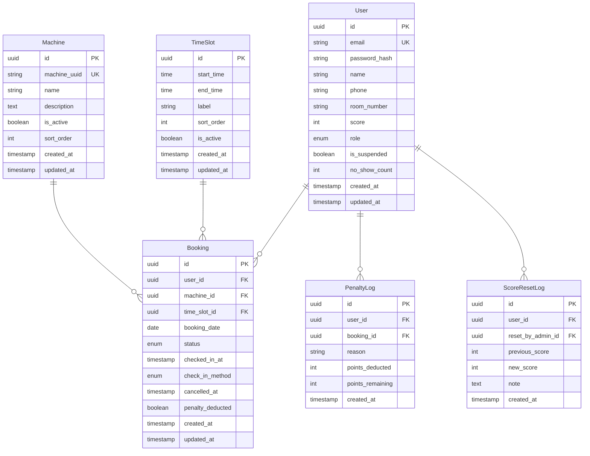

# ข้อกำหนดโครงการ (Project Specification)

> **ชื่อโครงการ:** ระบบจองเครื่องซักผ้าหอพัก
>
> **เวอร์ชัน:** 2.0.0
>
> **วันที่ปรับปรุงล่าสุด:** 17 กรกฎาคม 2569
>
> **ผู้จัดทำ:** [ปัญญาพร พลซา]
>
> **สถานะ:** ร่าง

---

## สารบัญ

1. [ภาพรวมโครงการ](#1-ภาพรวมโครงการ)
2. [ฟังก์ชันการทำงาน (Functional Requirements)](#2-ฟังก์ชันการทำงาน-functional-requirements)
3. [ข้อกำหนดด้านเทคนิค (Technical Requirements)](#3-ข้อกำหนดด้านเทคนิค-technical-requirements)
4. [UI/UX Design Requirements](#4-uiux-design-requirements)
5. [User Flow & Wireframe](#5-user-flow--wireframe)
6. [ข้อมูลและโครงสร้างฐานข้อมูล](#6-ข้อมูลและโครงสร้างฐานข้อมูล)
7. [API Endpoints](#7-api-endpoints)
8. [Non-functional Requirements](#8-non-functional-requirements)
9. [ข้อกำหนดด้าน Content](#9-ข้อกำหนดด้าน-content)
10. [แผนการพัฒนาและส่งมอบ](#10-แผนการพัฒนาและส่งมอบ)
11. [รายการหน้าที่และความรับผิดชอบ](#11-รายการหน้าที่และความรับผิดชอบ)

---

## 1. ภาพรวมโครงการ

### 1.1 ที่มาและความสำคัญ

> ปัจจุบันหอพักมีเครื่องซักผ้าหยอดเหรียญให้บริการผู้เช่า แต่พบปัญหาหลายประการ ได้แก่ การรอคิวเป็นเวลานานเพราะไม่รู้ว่าเครื่องว่างหรือไม่, การเสียเวลาเดินมาดูหน้าเครื่องโดยเปล่าประโยชน์, และการแย่งกันใช้เครื่องในช่วงเวลาเร่งด่วน ส่งผลให้ผู้เช่าเกิดความไม่สะดวกและไม่พึงพอใจในการใช้บริการ ดังนั้นจึงต้องการพัฒนาระบบจองเครื่องซักผ้าออนไลน์เพื่อให้ผู้เช่าสามารถดูสถานะเครื่องและจองล่วงหน้าผ่านเว็บไซต์ได้ ลดความขัดแย้งและเพิ่มความพึงพอใจให้กับผู้อยู่อาศัย

### 1.2 วัตถุประสงค์

1. เพื่อให้ผู้เช่าหอพักสามารถดูสถานะเครื่องซักผ้า (ว่าง/ไม่ว่าง) แบบเรียลไทม์ได้จากที่พัก
2. เพื่อให้ผู้เช่าสามารถจองรอบเวลาใช้เครื่องซักผ้าล่วงหน้าผ่านเว็บไซต์ได้
3. เพื่อให้ Admin สามารถกำหนดรอบเวลาซักผ้าตายตัวและจัดการเครื่องได้สะดวก
4. เพื่อลดปัญหาการแย่งกันใช้เครื่องซักผ้าในช่วงเวลาเร่งด่วน
5. เพื่อเก็บข้อมูลสถิติการใช้งานสำหรับวางแผนบริหารจัดการในอนาคต

### 1.3 กลุ่มเป้าหมาย (Target Users)

| กลุ่มผู้ใช้ | คำอธิบาย |
|-----------|---------|
| ผู้เช่าหอพัก | บุคคลทั่วไปที่พักอาศัยในหอพัก ต้องการใช้บริการเครื่องซักผ้า สามารถจองผ่านเว็บได้ |
| ผู้ดูแลระบบ (Admin) | เจ้าของหอพักที่ดูแลจัดการเครื่องซักผ้า กำหนดรอบเวลา ดูรายงาน และรีเซ็ตคะแนนผู้ใช้ |

### 1.4 ขอบเขตโครงการ (Scope)

| ในขอบเขต (In Scope) | นอกขอบเขต (Out of Scope) |
|-----------|-----------|
| ระบบสมัครสมาชิกและเข้าสู่ระบบ (ยืนยันด้วยเลขห้อง) | การเชื่อมต่อ IoT / ฮาร์ดแวร์เครื่องซักผ้าจริง |
| ระบบจัดการเครื่องซักผ้า (Admin เพิ่ม/ลบ/แก้ไขเครื่อง) | Mobile App แยก (พัฒนาเป็น Responsive Web เท่านั้น) |
| ระบบกำหนดรอบเวลาตายตัว (Admin ตั้งเวลาแต่ละรอบ) | ระบบชำระเงินออนไลน์ |
| ระบบดูตารางจอง (Grid แนวนอน = รอบ, แนวตั้ง = เครื่อง) | จองผ่าน Line โดยตรง (แจ้งเตือนผ่าน Line OA) |
| ระบบจอง (เลือกเครื่อง + รอบ, จองสูงสุด 2 รอบ/วัน ติดต่อกันได้) | บุคคลภายนอกที่ไม่ใช่ผู้เช่าหอพัก |
| ระบบจำกัดการจอง (จองได้สูงสุด 2 รอบต่อวัน รวมทุกเครื่อง, จองล่วงหน้าได้ 1 วัน) | ระบบซักแห้ง / รีด / บริการเสริมอื่น ๆ |
| ระบบยกเลิกการจอง (≥ 15 นาที ไม่เสียคะแนน, < 15 นาที หัก 1 คะแนน) | |
| ระบบคะแนน (เริ่มต้น 10, No-show หัก 2, ครบ 3 No-show ระงับสิทธิ์) | |
| Admin รีเซ็ตคะแนนเมื่อผู้ใช้ชำระค่าเสียหายแล้ว | |
| ระบบแจ้งเตือนผ่าน Line OA (ก่อนถึงรอบ 5 นาที, Check-in สำเร็จ, ยกเลิก, No-show, คะแนนต่ำ) | |
| Admin Dashboard (ดูการจองทั้งหมด, จัดการเครื่อง, ดูรอบเวลา, ดู/ดาวน์โหลด QR Code เครื่อง) | |
| ระบบรายงานสถิติ (จำนวนครั้งที่ใช้, ช่วงเวลายอดนิยม, เครื่องที่ถูกใช้มากสุด) | |
| ระบบ Check-in ด้วย QR Code (Machine UUID, QR Code อัตโนมัติ, สแกนยืนยันตัวตน) | การ Check-in โดย Admin / IoT / GPS / NFC |

---

## 2. ฟังก์ชันการทำงาน (Functional Requirements)

### 2.1 ระบบสมาชิกและบัญชีผู้ใช้

#### ผู้เช่าหอพัก (User)

| รหัส | ฟีเจอร์ | รายละเอียด | ระดับความสำคัญ |
|------|---------|------------|:-------------:|
| AUTH-01 | สมัครสมาชิก | สมัครด้วยอีเมล + รหัสผ่าน + เลขห้องพัก (ยืนยันว่าเป็นผู้เช่าจริง) | สูง |
| AUTH-02 | เข้าสู่ระบบ | ล็อกอินด้วยอีเมล + รหัสผ่าน | สูง |
| AUTH-03 | ลืมรหัสผ่าน | รีเซ็ตรหัสผ่านผ่านอีเมล | สูง |
| AUTH-04 | แก้ไขโปรไฟล์ | เปลี่ยนชื่อ, เบอร์โทร, รหัสผ่าน | ปานกลาง |
| AUTH-05 | ดูคะแนนของฉัน | แสดงคะแนนปัจจุบัน, ประวัติการหักคะแนน | ปานกลาง |

#### ผู้ดูแลระบบ (Admin)

| รหัส | ฟีเจอร์ | รายละเอียด | ระดับความสำคัญ |
|------|---------|------------|:-------------:|
| ADM-01 | จัดการผู้ใช้ | ดูข้อมูลผู้ใช้, รีเซ็ตคะแนน (หลังจากชำระค่าเสียหาย) | สูง |
| ADM-02 | จัดการเครื่องซักผ้า | เพิ่ม/ลบ/แก้ไขเครื่อง (ชื่อ, รายละเอียด, ดู Machine UUID, ดู/ดาวน์โหลด/พิมพ์ QR Code) | สูง |
| ADM-03 | จัดการรอบเวลา | กำหนดรอบเวลา เช่น 08:00-08:45, 08:45-09:30, ... | สูง |
| ADM-04 | จัดการ QR Code เครื่องซักผ้า | ดู/ดาวน์โหลด/พิมพ์ QR Code ของเครื่องซักผ้า | ปานกลาง |
| ADM-05 | ดูตารางจองทั้งหมด | ดูการจองทั้งหมด, ค้นหาตามวัน/เครื่อง/ผู้ใช้ | สูง |
| ADM-06 | ดูรายงานสถิติ | จำนวนครั้งที่ใช้, ช่วงเวลายอดนิยม, เครื่องขยันที่สุด | ปานกลาง |

### 2.2 ระบบจัดการเครื่องซักผ้า

| รหัส | ฟีเจอร์ | รายละเอียด |
|------|---------|------------|
| MCH-01 | เพิ่มเครื่องซักผ้า | กำหนดชื่อ (เช่น เครื่อง A, เครื่อง B), หมายเลข, รายละเอียด (ถ้ามี) |
| MCH-02 | แก้ไขเครื่องซักผ้า | แก้ไขชื่อหรือรายละเอียดเครื่อง |
| MCH-03 | ลบเครื่องซักผ้า | ลบเครื่องออกจากระบบ (เฉพาะที่ไม่มีประวัติการจอง) |
| MCH-04 | เปิด/ปิดเครื่อง | ตั้งสถานะเครื่องว่าเปิดให้จอง หรือ ปิดซ่อมบำรุง |
| MCH-05 | สร้าง Machine UUID อัตโนมัติ | เมื่อเพิ่มเครื่องใหม่ ระบบสร้าง Machine UUID โดยอัตโนมัติ (UUID v4) |
| MCH-06 | สร้าง QR Code อัตโนมัติ | เมื่อเพิ่มเครื่องใหม่ ระบบสร้าง QR Code จาก Machine UUID โดยอัตโนมัติ โดย QR Code เก็บ URL /check-in/{machine_uuid} |
| MCH-07 | แสดง/ดาวน์โหลด/พิมพ์ QR Code | Admin สามารถดูตัวอย่าง QR Code, ดาวน์โหลดเป็นไฟล์ภาพ และพิมพ์ QR Code จากหน้าจัดการเครื่อง |
| MCH-08 | QR Code ไม่เปลี่ยนแปลงเมื่อแก้ไขเครื่อง | การเปลี่ยนชื่อหรือรายละเอียดเครื่อง ไม่มีผลต่อ Machine UUID และ QR Code เดิม |
| MCH-09 | QR Code ใช้งานไม่ได้เมื่อลบเครื่อง | เมื่อลบเครื่อง ระบบเปลี่ยนสถานะ QR Code ให้ใช้งานไม่ได้ทันทีผ่านการตรวจสอบ Machine ที่ถูกลบ |

### 2.3 ระบบจัดการรอบเวลา

| รหัส | ฟีเจอร์ | รายละเอียด |
|------|---------|------------|
| SLT-01 | กำหนดรอบเวลา | Admin ตั้งค่ารอบเวลา เช่น 08:00-08:45, 08:45-09:30 (แต่ละรอบยาวเท่ากัน) |
| SLT-02 | แก้ไขรอบเวลา | ปรับเปลี่ยนรอบเวลาตามต้องการ |
| SLT-03 | ลบรอบเวลา | ลบรอบเวลา (เฉพาะที่ยังไม่มีการจอง) |

### 2.4 ระบบจอง

| รหัส | ฟีเจอร์ | รายละเอียด |
|------|---------|------------|
| BKG-01 | ดูตารางจอง | แสดง Grid ตาราง (แนวตั้ง = เครื่อง, แนวนอน = รอบ) พร้อมสถานะ ว่าง/จองแล้ว/กำลังซัก/ไม่เปิดให้จอง |
| BKG-02 | เลือกจอง | ผู้ใช้เลือกเครื่อง + รอบที่ว่าง และยืนยันการจอง |
| BKG-03 | จองติดต่อกัน | จองหลายรอบติดต่อกันบนเครื่องเดียวกันได้ (เช่น 08:00 + 08:45) แต่รวมทุกเครื่องต้องไม่เกิน 2 รอบต่อวัน |
| BKG-04 | ตรวจสอบการจองซ้ำ | ป้องกันการจองซ้ำในเครื่อง+รอบเดียวกัน |
| BKG-05 | ตรวจสอบจำนวนจองต่อวัน | ผู้ใช้จองได้สูงสุด 2 Time Slot ต่อวันรวมทุกเครื่อง ระบบตรวจสอบก่อนยืนยันการจอง |
| BKG-06 | ยกเลิกการจอง | ยกเลิกก่อน ≥ 15 นาที: ไม่เสียคะแนน / ยกเลิกก่อน < 15 นาที: หัก 1 คะแนน |
| BKG-07 | แสดงประวัติการจอง | ผู้ใช้ดูประวัติการจองของตัวเอง (สถานะ, วันที่, เครื่อง, รอบ) |

### 2.5 ระบบคะแนน (Reputation System)

| รหัส | ฟีเจอร์ | รายละเอียด |
|------|---------|------------|
| REP-01 | คะแนนเริ่มต้น | ผู้ใช้เริ่มต้นที่ 10 คะแนน |
| REP-02 | หักคะแนน No-show | ไม่มาตามรอบที่จอง → หัก 2 คะแนน |
| REP-03 | หักคะแนนยกเลิกสาย | ยกเลิกก่อนถึงคิว < 15 นาที → หัก 1 คะแนน |
| REP-04 | แจ้งเตือนคะแนนเหลือน้อย | แจ้งเตือนเมื่อคะแนน ≤ 3 |
| REP-05 | ระงับสิทธิ์ | No-show ครบ 3 ครั้ง → ถูกระงับสิทธิ์การจองอัตโนมัติ |
| REP-06 | รีเซ็ตคะแนนโดย Admin | เจ้าของหอรีเซ็ตคะแนนเมื่อผู้ใช้มาชำระค่าเสียหายแล้ว |
| REP-07 | แสดงประวัติการหักคะแนน | แสดงสาเหตุ, วันที่, คะแนนคงเหลือ |

### 2.6 ระบบแจ้งเตือน (Line Notification)

| รหัส | ฟีเจอร์ | รายละเอียด |
|------|---------|------------|
| NOTI-01 | แจ้งเตือนก่อนถึงรอบ | ส่ง Line แจ้งเตือนผู้ใช้ก่อนถึงรอบที่จองไว้ 5 นาที |
| NOTI-02 | แจ้งเตือน Check-in สำเร็จ | ส่ง Line แจ้งเตือนเมื่อผู้ใช้ Check-in สำเร็จ |
| NOTI-03 | แจ้งเตือนยกเลิก | ส่ง Line เมื่อผู้ใช้ยกเลิกการจอง หรือ Admin ยกเลิกให้ |
| NOTI-04 | แจ้งเตือน No-show | ส่ง Line แจ้งเตือนเมื่อผู้ใช้ไม่มา Check-in ตามรอบที่จอง พร้อมแจ้งจำนวนคะแนนที่ถูกหัก |
| NOTI-05 | แจ้งเตือนคะแนนต่ำ | ส่ง Line เมื่อคะแนนเหลือ ≤ 3 หรือถูกหักคะแนน |
| NOTI-06 | แจ้งเตือนระงับสิทธิ์ | ส่ง Line เมื่อผู้ใช้ถูกระงับสิทธิ์การจองอัตโนมัติ (No-show ครบ 3 ครั้ง) |

### 2.7 ระบบ Check-in ด้วย QR Code

| รหัส | ฟีเจอร์ | รายละเอียด |
|------|---------|------------|
| CHK-01 | สร้าง Machine UUID | เมื่อ Admin เพิ่มเครื่องซักผ้า ระบบสร้าง Machine UUID (UUID v4) อัตโนมัติและบันทึกลงฐานข้อมูล |
| CHK-02 | สร้าง QR Code อัตโนมัติ | เมื่อเพิ่มเครื่อง ระบบสร้าง QR Code Image ที่เก็บ URL `/check-in/{machine_uuid}` โดยอัตโนมัติ |
| CHK-03 | แสดง QR Code | Admin สามารถดูตัวอย่าง QR Code ในหน้าจัดการเครื่องซักผ้า |
| CHK-04 | ดาวน์โหลด QR Code | Admin สามารถดาวน์โหลด QR Code เป็นไฟล์ภาพ (PNG/SVG) |
| CHK-05 | พิมพ์ QR Code | Admin สามารถพิมพ์ QR Code เพื่อนำไปติดหน้าเครื่องซักผ้า |
| CHK-06 | สแกน QR Code Check-in | ผู้ใช้สแกน QR Code ที่หน้าเครื่อง ระบบตรวจสอบสิทธิ์และบันทึกการ Check-in |
| CHK-07 | ตรวจสอบสิทธิ์ Check-in | ระบบตรวจสอบว่าผู้ใช้ Login แล้ว, มีรายการจองวันนี้, เป็นเจ้าของรายการจอง, QR Code ตรงกับเครื่องที่จอง, อยู่ในช่วงเวลาที่กำหนด, และยังไม่เคย Check-in |
| CHK-08 | ตรวจสอบช่วงเวลา Check-in | ผู้ใช้สามารถ Check-in ได้ตั้งแต่ก่อนเวลาเริ่มรอบ 5 นาที จนถึงหลังเวลาเริ่มรอบ 15 นาที |
| CHK-09 | บันทึก Check-in | เมื่อผ่านเงื่อนไขทั้งหมด ระบบบันทึกเวลาใน checked_in_at และเปลี่ยนสถานะเป็น checked_in |
| CHK-10 | เปลี่ยนสถานะเป็น Completed | เมื่อหมดรอบเวลา ระบบเปลี่ยนสถานะจาก checked_in เป็น completed อัตโนมัติ |
| CHK-11 | เปลี่ยนสถานะเป็น No-show | หากพ้นช่วงเวลา Check-in (หลังเวลาเริ่มรอบ 15 นาที) แล้วผู้ใช้ยังไม่ Check-in ระบบเปลี่ยนสถานะเป็น no_show และหัก 2 คะแนนอัตโนมัติ |
| CHK-12 | แสดงข้อความสแกนก่อนเวลา | หากสแกนก่อนเวลาเริ่มรอบ 5 นาที แสดงข้อความ "ยังไม่ถึงเวลา Check-in" |
| CHK-13 | แสดงข้อความสแกนหลังเวลา | หากสแกนหลังเวลาเริ่มรอบ 15 นาที แสดงข้อความ "หมดเวลาการ Check-in" และดำเนินการ No-show อัตโนมัติ |
| CHK-14 | แสดงข้อความสแกนผิดเครื่อง | หากสแกน QR Code ที่ไม่ตรงกับเครื่องที่จอง แสดงข้อความ "คุณไม่ได้จองเครื่องนี้" |
| CHK-15 | แสดงข้อความ Check-in ซ้ำ | หากสแกนซ้ำหลังจาก Check-in สำเร็จแล้ว แสดงข้อความ "คุณได้ Check-in แล้ว" |
| CHK-16 | QR Code ไม่เปลี่ยนแปลงเมื่อเปลี่ยนชื่อเครื่อง | การเปลี่ยนชื่อเครื่องไม่มีผลต่อ Machine UUID และ QR Code เดิม ยังคงใช้งานได้ |
| CHK-17 | QR Code ใช้งานไม่ได้เมื่อลบเครื่อง | เมื่อลบเครื่อง ระบบเปลี่ยนสถานะ is_active เป็น false ระบบตรวจสอบสถานะเครื่องก่อนอนุญาตให้ Check-in |

---

## 3. ข้อกำหนดด้านเทคนิค (Technical Requirements)

### 3.1 Technology Stack

| ชั้น (Layer) | เทคโนโลยีที่เลือก | เหตุผล |
|-------------|-----------------|--------|
| **Runtime** | Bun | เร็ว, รองรับ ElysiaJS และ SQLite built-in |
| **Frontend** | React + Vite + TypeScript | แยกจาก Backend ชัดเจน, dev experience ดี |
| **Styling** | Tailwind CSS + shadcn/ui | ประหยัดเวลา, UI สวยงามทันที |
| **Backend** | ElysiaJS + TypeScript | เร็ว, syntax ง่าย, type-safe |
| **Database** | SQLite (Bun built-in) | ไม่ต้องตั้งค่าเซิร์ฟเวอร์, ไฟล์เดียวพกพาสะดวก |
| **ORM** | Drizzle ORM | type-safe, migration อัตโนมัติ, ทำงานกับ SQLite ได้ดี |
| **Authentication** | @elysiajs/jwt | JWT ในตัว ไม่ต้องพึ่ง library ภายนอก |
| **Line Notification** | Line Messaging API | ส่งแจ้งเตือนผ่าน Line OA |
| **Hosting** | Fly.io | รองรับ Bun, มี Persistent Volume 3GB ฟรีสำหรับ SQLite |
| **Version Control** | GitHub | |
| **Domain** | [กำหนดภายหลัง] | |

### 3.2 Browser Support

- Google Chrome, Firefox, Safari, Edge (2 เวอร์ชันล่าสุด)
- Safari iOS, Chrome Android

### 3.3 Responsive Design

- Desktop: 1024px+
- Tablet: 768px - 1023px
- Mobile: 320px - 767px (เน้นมือถือเพราะผู้ใช้อยู่หอพัก)

### 3.4 ข้อกำหนดด้าน Security

- [x] HTTPS (SSL/TLS) ทุกหน้า
- [x] Hash รหัสผ่านด้วย bcrypt
- [x] ป้องกัน XSS, CSRF, SQL Injection
- [x] Rate Limiting
- [x] JWT Token มีอายุและ Refresh
- [x] ตรวจสอบสิทธิ์ทุก API endpoint
- [x] ตรวจสอบว่าผู้ใช้จองเฉพาะรอบที่ยังไม่ผ่านแล้วเท่านั้น
- [x] Rate Limiting สำหรับ endpoint Check-in (ป้องกันการสแกนซ้ำหลายครั้ง)
- [x] ตรวจสอบรูปแบบ machine_uuid (UUID v4) ก่อนประมวลผล
- [x] ตรวจสอบสถานะ is_active ของเครื่องก่อนอนุญาตให้ Check-in

---

## 4. UI/UX Design Requirements

### 4.1 แนวทางการออกแบบ

- **โทนสี:** (เลือกตามชอบ เช่น น้ำเงิน + ฟ้า ให้ความรู้สึกสะอาด)
- **ฟอนต์:** Prompt หรือ Sarabun (รองรับภาษาไทยดี)
- **ดีไซน์:** Modern, เรียบง่าย, ใช้งานง่ายบนมือถือเป็นหลัก

### 4.2 หน้าหลักของระบบ

| หน้า | รายละเอียด |
|------|-----------|
| หน้าแรก (Home) | แสดงตารางจองวันนี้ (Grid เครื่อง × รอบ), ปุ่มไปจองพรุ่งนี้, แสดงการจองของฉันวันนี้ |
| หน้าจอง (Booking) | แสดงตารางเต็ม, เลือกวันที่ (วันนี้/พรุ่งนี้), เลือกเครื่อง + รอบที่ว่าง, ตรวจสอบจำนวนจอง (สูงสุด 2 รอบ/วัน), ยืนยันการจอง |
| ประวัติการจองของฉัน | แสดงรายการจองทั้งหมด, สถานะ (กำลังซัก/เสร็จแล้ว/ยกเลิก/No-show) |
| โปรไฟล์ของฉัน | ข้อมูลส่วนตัว, คะแนนปัจจุบัน, ประวัติการหักคะแนน |
| แดชบอร์ด Admin | ภาพรวม, จำนวนการจองวันนี้, เครื่องที่กำลังซัก, ผู้ใช้ที่ถูกระงับสิทธิ์ |
| จัดการเครื่อง (Admin) | เพิ่ม/แก้ไข/เปิด-ปิดเครื่อง, ดู Machine UUID, ดู/ดาวน์โหลด/พิมพ์ QR Code |
| จัดการรอบเวลา (Admin) | เพิ่ม/แก้ไข/ลบรอบเวลา |
| จัดการผู้ใช้ (Admin) | ดูผู้ใช้, ดูประวัติ, รีเซ็ตคะแนน |
| ดูตารางจองทั้งหมด (Admin) | ดูทุกการจอง, ค้นหา, กรอง |

### 4.3 Design System Components

- ตาราง Grid (Booking Grid) — Component หลักของระบบ
- Booking Card — แสดงข้อมูลการจองแต่ละรายการ
- Status Badge — ว่าง/จองแล้ว/กำลังซัก/ปิดซ่อม
- Score Badge — แสดงคะแนนผู้ใช้
- Modal ยืนยันการจอง
- Modal ยกเลิก + แจ้งเตือนผลของการยกเลิก (เสียคะแนนหรือไม่)
- QR Code Preview — แสดงภาพตัวอย่าง QR Code ของเครื่อง
- Check-in Page — UI สำหรับสแกน QR Code และแสดงสถานะ Check-in

### 4.4 Accessibility (a11y)

- คอนทราสต์สีผ่านเกณฑ์ WCAG 2.1 AA
- รองรับการนำทางด้วยคีย์บอร์ด
- ขนาดฟอนต์อย่างน้อย 16px บนมือถือ
- แสดงสถานะชัดเจน (สี + ข้อความ) ไม่ใช้สีเป็นตัวบอกเพียงอย่างเดียว

---

## 5. User Flow & Wireframe

### 5.1 User Flow หลัก

**Flow การจองของผู้เช่า:**

```
หน้าแรก → ดูตารางจองวันนี้
            ↓
        เลือกวันที่ (วันนี้ หรือ พรุ่งนี้) → เลือกเครื่อง + รอบที่ว่าง
            ↓
        กด "จอง" → ระบบตรวจสอบ (ไม่เกิน 2 รอบ/วัน) → ✅ สำเร็จ → แจ้งเตือน Line
            ↓
        LINE แจ้งเตือนก่อนถึงรอบ 5 นาที
            ↓
        ผู้ใช้เดินมาที่เครื่องซักผ้า
            ↓
        สแกน QR Code บนเครื่อง
            ↓
        ระบบตรวจสอบสิทธิ์ → ผ่าน → Check-in สำเร็จ → แจ้งเตือน Line
            ↓                                       ↓
        ซักผ้าจนครบรอบ → ระบบเปลี่ยนเป็น Completed
            ↓
        หรือ
            ↓
        ไม่มา Check-in ภายในเวลา (เริ่มรอบ + 15 นาที)
            ↓
        No-show → หัก 2 คะแนน → แจ้งเตือน Line
            ↓
        ครบ 3 No-show → ถูกระงับสิทธิ์ → พบเจ้าของหอ → จ่ายค่าเสียหาย → Admin รีเซ็ตคะแนน
```

**Flow การยกเลิก:**

```
ผู้เช่ายกเลิก
    ├── ≥ 15 นาทีก่อนถึงคิว → ยกเลิกได้ → ไม่เสียคะแนน
    └── < 15 นาทีก่อนถึงคิว → ยกเลิกได้ → หัก 1 คะแนน
```

**Flow Admin:**

```
ล็อกอิน Admin → แดชบอร์ด
    ├── จัดการเครื่อง → เพิ่ม/แก้ไข/เปิด-ปิด
    ├── จัดการรอบเวลา → เพิ่ม/แก้ไข/ลบ
    ├── จัดการผู้ใช้ → ดูประวัติ → รีเซ็ตคะแนน
    ├── ดูตารางจองทั้งหมด → ค้นหา/กรอง
    └── ดูรายงานสถิติ
```

### 5.2 Sitemap (ผังเว็บ)

```
/
├── /booking (ตารางจอง)
├── /booking?date=YYYY-MM-DD (จองตามวันที่)
├── /my-bookings (ประวัติการจอง)
├── /my-score (คะแนนและประวัติ)
├── /profile (แก้ไขโปรไฟล์)
├── /auth
│   ├── /auth/login
│   ├── /auth/register
│   └── /auth/forgot-password
├── /check-in/:machine_uuid (หน้า Check-in ด้วย QR Code)
├── /admin
│   ├── /admin/dashboard
│   ├── /admin/machines (จัดการเครื่อง, ดู QR Code)
│   ├── /admin/time-slots (จัดการรอบเวลา)
│   ├── /admin/bookings (ดูการจองทั้งหมด)
│   ├── /admin/users (จัดการผู้ใช้)
│   └── /admin/reports (รายงานสถิติ)
```

### 5.3 Use Case Diagram

```mermaid
flowchart TB
    subgraph System["ระบบจองเครื่องซักผ้าหอพัก"]
        direction TB
        
        subgraph Auth["Authentication"]
            A1["สมัครสมาชิก"]
            A2["เข้าสู่ระบบ"]
            A3["ลืมรหัสผ่าน"]
        end
        
        subgraph Booking["ระบบจอง"]
            B1["ดูตารางจอง"]
            B2["จองรอบเวลา"]
            B3["ยกเลิกการจอง"]
            B4["QR Code Check-in"]
            B5["ดูประวัติการจอง"]
        end
        
        subgraph Score["ระบบคะแนน"]
            S1["ดูคะแนนของฉัน"]
            S2["ประวัติการหักคะแนน"]
        end
        
        subgraph MachineMgmt["Admin: จัดการเครื่อง"]
            M1["เพิ่ม/แก้ไข/ลบเครื่อง"]
            M2["เปิด/ปิดเครื่อง"]
        end
        
        subgraph SlotMgmt["Admin: จัดการรอบเวลา"]
            T1["เพิ่ม/แก้ไข/ลบรอบเวลา"]
        end
        
        subgraph UserMgmt["Admin: จัดการผู้ใช้"]
            U1["ดูข้อมูลผู้ใช้"]
            U2["รีเซ็ตคะแนน"]
            U3["ปลดระงับสิทธิ์"]
        end
        
        subgraph ReportMgmt["Admin: รายงาน"]
            R1["ดูรายงานสถิติ"]
            R2["ดูตารางจองทั้งหมด"]
        end
    end
    
    ActorUser(["ผู้เช่าหอพัก (User)"])
    ActorAdmin(["ผู้ดูแลระบบ (Admin)"])
    
    ActorUser --> A1
    ActorUser --> A2
    ActorUser --> A3
    ActorUser --> B1
    ActorUser --> B2
    ActorUser --> B3
    ActorUser --> B4
    ActorUser --> B5
    ActorUser --> S1
    ActorUser --> S2
    
    ActorAdmin --> A2
    ActorAdmin --> M1
    ActorAdmin --> M2
    ActorAdmin --> T1
    ActorAdmin --> U1
    ActorAdmin --> U2
    ActorAdmin --> U3
    ActorAdmin --> R1
    ActorAdmin --> R2
    ActorAdmin --> B1
    ActorAdmin --> B5
```



---

## 6. ข้อมูลและโครงสร้างฐานข้อมูล

### 6.1 Entity Relationship Diagram (ERD)



### 6.2 ตารางหลัก

#### users

| คอลัมน์ | ชนิดข้อมูล | คำอธิบาย |
|---------|-----------|---------|
| id | UUID | Primary Key |
| email | VARCHAR(255) | Unique, Not Null |
| password_hash | VARCHAR(255) | Not Null |
| name | VARCHAR(100) | |
| phone | VARCHAR(20) | |
| room_number | VARCHAR(20) | เลขห้องพัก, Not Null |
| score | INTEGER | คะแนนปัจจุบัน, Default: 10 |
| role | ENUM('user', 'admin') | Default: 'user' |
| is_suspended | BOOLEAN | Default: false (ถูกระงับสิทธิ์) |
| no_show_count | INTEGER | จำนวน No-show สะสม, Default: 0 |
| created_at | TIMESTAMP | |
| updated_at | TIMESTAMP | |

#### machines

| คอลัมน์ | ชนิดข้อมูล | คำอธิบาย |
|---------|-----------|---------|
| id | UUID | Primary Key |
| machine_uuid | VARCHAR(36) | Unique, Not Null — UUID v4 สำหรับอ้างอิงใน QR Code |
| name | VARCHAR(100) | เช่น "เครื่อง A" |
| description | TEXT | |
| is_active | BOOLEAN | Default: true (false = ปิดซ่อม) |
| sort_order | INTEGER | ลำดับการแสดงผล |
| created_at | TIMESTAMP | |
| updated_at | TIMESTAMP | |

#### time_slots

| คอลัมน์ | ชนิดข้อมูล | คำอธิบาย |
|---------|-----------|---------|
| id | UUID | Primary Key |
| start_time | TIME | เช่น 08:00 |
| end_time | TIME | เช่น 08:45 |
| label | VARCHAR(50) | เช่น "รอบที่ 1" |
| sort_order | INTEGER | |
| is_active | BOOLEAN | Default: true |
| created_at | TIMESTAMP | |
| updated_at | TIMESTAMP | |

#### bookings

| คอลัมน์ | ชนิดข้อมูล | คำอธิบาย |
|---------|-----------|---------|
| id | UUID | Primary Key |
| user_id | UUID | FK → users.id |
| machine_id | UUID | FK → machines.id |
| time_slot_id | UUID | FK → time_slots.id |
| booking_date | DATE | วันที่จอง |
| status | ENUM('pending','checked_in','completed','cancelled','no_show') | |
| checked_in_at | TIMESTAMP | เวลาที่ผู้ใช้สแกน QR Code และ Check-in สำเร็จ (nullable) |
| check_in_method | ENUM('qr') | วิธีการ Check-in, Default: 'qr' (nullable) |
| cancelled_at | TIMESTAMP | เวลาที่ยกเลิก (nullable) |
| penalty_deducted | BOOLEAN | Default: false |
| created_at | TIMESTAMP | |
| updated_at | TIMESTAMP | |

> **UNIQUE CONSTRAINT:** (machine_id, time_slot_id, booking_date) — ป้องกันการจองซ้ำ

#### penalty_logs

| คอลัมน์ | ชนิดข้อมูล | คำอธิบาย |
|---------|-----------|---------|
| id | UUID | Primary Key |
| user_id | UUID | FK → users.id |
| booking_id | UUID | FK → bookings.id |
| reason | VARCHAR(255) | สาเหตุ (no_show / cancel_late) |
| points_deducted | INTEGER | จำนวนคะแนนที่หัก |
| points_remaining | INTEGER | คะแนนคงเหลือหลังจากหัก |
| created_at | TIMESTAMP | |

#### score_reset_logs

| คอลัมน์ | ชนิดข้อมูล | คำอธิบาย |
|---------|-----------|---------|
| id | UUID | Primary Key |
| user_id | UUID | FK → users.id (ผู้ใช้ที่ถูกรีเซ็ต) |
| reset_by_admin_id | UUID | FK → users.id (Admin ที่เป็นคนรีเซ็ต) |
| previous_score | INTEGER | คะแนนก่อนรีเซ็ต |
| new_score | INTEGER | คะแนนหลังรีเซ็ต (ปกติ = 10) |
| note | TEXT | เช่น "จ่ายค่าเสียหายแล้ว" |
| created_at | TIMESTAMP | |

---

## 7. API Endpoints

### 7.1 รูปแบบ API

- **Base URL:** `/api/v1`
- **Authentication:** JWT Bearer Token
- **Response Format:** JSON

### 7.2 Authentication

| Method | Endpoint | คำอธิบาย | Auth |
|--------|----------|---------|:----:|
| POST | `/auth/register` | สมัครสมาชิก | ❌ |
| POST | `/auth/login` | เข้าสู่ระบบ | ❌ |
| POST | `/auth/forgot-password` | ขอรีเซ็ตรหัสผ่าน | ❌ |
| POST | `/auth/reset-password` | รีเซ็ตรหัสผ่าน | ❌ |
| GET | `/auth/me` | ดูข้อมูลผู้ใช้ปัจจุบัน | ✅ |
| PUT | `/auth/me` | แก้ไขโปรไฟล์ | ✅ |

### 7.3 Machines

| Method | Endpoint | คำอธิบาย | Auth |
|--------|----------|---------|:----:|
| GET | `/machines` | รายการเครื่องซักผ้าทั้งหมด | ❌ |
| GET | `/machines/:id` | รายละเอียดเครื่อง | ❌ |
| POST | `/admin/machines` | เพิ่มเครื่อง | ✅ Admin |
| PUT | `/admin/machines/:id` | แก้ไขเครื่อง | ✅ Admin |
| DELETE | `/admin/machines/:id` | ลบเครื่อง | ✅ Admin |

### 7.4 Time Slots

| Method | Endpoint | คำอธิบาย | Auth |
|--------|----------|---------|:----:|
| GET | `/time-slots` | รายการรอบเวลาทั้งหมด | ❌ |
| POST | `/admin/time-slots` | เพิ่มรอบเวลา | ✅ Admin |
| PUT | `/admin/time-slots/:id` | แก้ไขรอบเวลา | ✅ Admin |
| DELETE | `/admin/time-slots/:id` | ลบรอบเวลา | ✅ Admin |
| PUT | `/admin/time-slots/batch` | จัดการรอบเวลาพร้อมกัน (บันทึกทั้งหมด) | ✅ Admin |

### 7.5 Bookings

| Method | Endpoint | คำอธิบาย | Auth |
|--------|----------|---------|:----:|
| GET | `/bookings?date=&machine_id=` | ดูการจองตามวันที่/เครื่อง (สำหรับแสดง Grid) | ✅ |
| GET | `/bookings/available?date=` | ดูรอบว่างตามวันที่ | ✅ |
| POST | `/bookings` | สร้างการจอง | ✅ |
| DELETE | `/bookings/:id` | ยกเลิกการจอง (ตรวจสอบเวลาอัตโนมัติว่าหักคะแนนหรือไม่) | ✅ |
| GET | `/bookings/my` | ประวัติการจองของผู้ใช้ | ✅ |
| GET | `/admin/bookings` | การจองทั้งหมด (Admin) | ✅ Admin |

### 7.6 Score / Penalty

| Method | Endpoint | คำอธิบาย | Auth |
|--------|----------|---------|:----:|
| GET | `/users/me/score` | ดูคะแนนและประวัติการหักคะแนน | ✅ |
| GET | `/admin/users` | รายการผู้ใช้ทั้งหมด | ✅ Admin |
| GET | `/admin/users/:id` | ข้อมูลผู้ใช้ + ประวัติ | ✅ Admin |
| PUT | `/admin/users/:id/reset-score` | รีเซ็ตคะแนนผู้ใช้ (หลังชำระค่าเสียหาย) | ✅ Admin |
| PUT | `/admin/users/:id/unsuspend` | ปลดระงับสิทธิ์ | ✅ Admin |

### 7.7 Reports

| Method | Endpoint | คำอธิบาย | Auth |
|--------|----------|---------|:----:|
| GET | `/admin/reports/daily` | รายงานรายวัน | ✅ Admin |
| GET | `/admin/reports/monthly` | รายงานรายเดือน | ✅ Admin |
| GET | `/admin/reports/machine-usage` | สถิติการใช้งานต่อเครื่อง | ✅ Admin |

### 7.8 Check-in

| Method | Endpoint | คำอธิบาย | Auth |
|--------|----------|---------|:----:|
| POST | `/check-in` | สแกน QR Code เพื่อ Check-in — รับ `machine_uuid` ใน Body, ตรวจสอบสิทธิ์และบันทึก Check-in | ✅ |
| GET | `/admin/machines/:id/qr-code` | ดู QR Code ของเครื่อง (ภาพตัวอย่าง) | ✅ Admin |
| GET | `/admin/machines/:id/qr-code/download` | ดาวน์โหลด QR Code เป็นไฟล์ภาพ (PNG) | ✅ Admin |
| GET | `/check-in/:machine_uuid` | หน้าเว็บสำหรับสแกน QR Code (แสดง UI Check-in) | ❌ |

#### POST /api/v1/check-in — Request Body

```json
{
  "machine_uuid": "xxxxxxxx-xxxx-xxxx-xxxx-xxxxxxxxxxxx"
}
```

#### POST /api/v1/check-in — Response

| Status Code | เงื่อนไข | Response Body |
|:-----------:|---------|---------------|
| 200 | Check-in สำเร็จ | `{ "success": true, "message": "Check-in สำเร็จ", "booking": {...} }` |
| 400 | ส่ง machine_uuid ไม่ถูกต้อง | `{ "success": false, "message": "machine_uuid is required" }` |
| 401 | ยังไม่ Login | `{ "success": false, "message": "Unauthorized" }` |
| 404 | ไม่มีรายการจองวันนี้ที่ตรงกับเครื่องนี้ | `{ "success": false, "message": "ไม่พบรายการจอง" }` |
| 403 | ไม่ใช่เจ้าของรายการจอง | `{ "success": false, "message": "คุณไม่ได้จองเครื่องนี้" }` |
| 403 | สแกนก่อนเวลา | `{ "success": false, "message": "ยังไม่ถึงเวลา Check-in" }` |
| 403 | สแกนหลังเวลา (No-show แล้ว) | `{ "success": false, "message": "หมดเวลาการ Check-in" }` |
| 409 | Check-in ซ้ำแล้ว | `{ "success": false, "message": "คุณได้ Check-in แล้ว" }` |
| 410 | เครื่องถูกลบหรือปิดใช้งาน | `{ "success": false, "message": "เครื่องนี้ไม่พร้อมให้บริการ" }` |
---

## 8. Non-functional Requirements

### 8.1 Performance

- **โหลดหน้า Grid จอง:** ≤ 1.5 วินาที
- **API Response Time:** ≤ 200ms (เฉลี่ย)
- **รองรับผู้ใช้พร้อมกัน:** เริ่มต้น ≥ 50 คน (หอพักทั่วไป)

### 8.2 Reliability

- **Backup:** สำรองข้อมูลฐานข้อมูลทุกวัน
- **Uptime:** ≥ 99% (Fly.io มี SLA สูง)

### 8.3 Security

- HTTPS ทุกหน้า
- Input validation ทุก endpoint
- ตรวจสอบว่าผู้ใช้จองในนามตัวเองเท่านั้น (ป้องกันการจองแทนคนอื่น)
- ตรวจสอบเวลา — ป้องกันการจองย้อนหลังหรือจองเกินวันที่ Admin กำหนด

### 8.4 Scalability

- ออกแบบ DB schema ให้รองรับการเพิ่มเครื่องได้ไม่จำกัด
- API ออกแบบให้ทำ pagination ได้
- ระบบต้องรองรับการเพิ่มเครื่องซักผ้าในอนาคตโดยไม่ต้องแก้ไข QR Code ของเครื่องเดิม (ใช้ Machine UUID เป็นตัวอ้างอิง)

### 8.5 QR Code Requirements

- ระบบต้องสร้าง QR Code อัตโนมัติเมื่อ Admin เพิ่มเครื่องใหม่ โดยไม่ต้องดำเนินการใด ๆ เพิ่มเติม
- การสร้างและดาวน์โหลด QR Code ใช้เวลาไม่เกิน 2 วินาที
- QR Code ต้องมีความละเอียดเพียงพอสำหรับการพิมพ์ (อย่างน้อย 300x300 px)
- QR Code ต้องเก็บเฉพาะ URL `/check-in/{machine_uuid}` — ห้ามใช้ชื่อเครื่องหรือข้อมูลอื่นที่เปลี่ยนแปลงได้
- Machine UUID ต้องไม่ซ้ำกันในระบบ

---

## 9. ข้อกำหนดด้าน Content

### 9.1 ข้อความ

| รายการ | รายละเอียด |
|--------|-----------|
| ข้อความในเว็บ | ชื่อเครื่อง, รอบเวลา, สถานะ, ข้อความยืนยันการจอง, QR Code Preview |
| ข้อความแจ้งเตือน Line | "อีก 5 นาทีจะถึงรอบซักของคุณ", "Check-in สำเร็จแล้ว", "ยกเลิกการจองแล้ว", "คุณไม่มา Check-in ตามรอบ — หัก 2 คะแนน", "คะแนนของคุณเหลือน้อย", "สิทธิ์การจองของคุณถูกระงับ" |
| ข้อความแจ้งเตือนคะแนน | "คุณถูกหักคะแนน", "คะแนนเหลือน้อย", "สิทธิ์ถูกระงับ" |
| ข้อความ Error | กรณีจองซ้ำ, จองย้อนหลัง, ไม่มีสิทธิ์จอง, สแกน QR ก่อนเวลา, สแกน QR หลังเวลา, สแกนผิดเครื่อง, Check-in ซ้ำ |

### 9.2 รูปภาพ

| รายการ | รายละเอียด |
|--------|-----------|
| รูปภาพเครื่องซักผ้า | Admin อัปโหลดรูปเครื่อง (ไม่บังคับ) |
| Logo หอพัก | SVG |
| Favicon | favicon.ico |

---

## 10. แผนการพัฒนาและส่งมอบ

### 10.1 Milestones (ทำคนเดียว)

| Phase | ระยะเวลา | Deliverables |
|-------|---------|-------------|
| **Phase 1: Foundation** | สัปดาห์ที่ 1 | Setup Project (Bun + ElysiaJS + React), Drizzle Schema, Auth System (JWT), UI Framework (shadcn/ui) |
| **Phase 2: Core Booking** | สัปดาห์ที่ 2-3 | ระบบเครื่อง (รวม Machine UUID, QR Code), รอบเวลา, ตาราง Grid, จอง/ยกเลิก |
| **Phase 3: Score & Notify** | สัปดาห์ที่ 4 | ระบบคะแนน, Penalty, Line Notification (แจ้งก่อนรอบ 5 นาที, Check-in, No-show, คะแนนต่ำ) |
| **Phase 4: Admin Panel** | สัปดาห์ที่ 5 | Dashboard Admin, จัดการผู้ใช้, รายงาน |
| **Phase 5: Polish & Deploy** | สัปดาห์ที่ 6 | ทดสอบ, แก้บัค, Deploy ขึ้น Production |

### 10.2 การทดสอบ

- ทดสอบ Flow การจองหลักด้วยตนเอง
- ทดสอบการหักคะแนนและ No-show
- ทดสอบ Line Notification (ก่อนรอบ 5 นาที, Check-in, No-show, คะแนนต่ำ)
- ทดสอบ QR Code Check-in (ก่อนเวลา, ตรงเวลา, สาย, ผิดเครื่อง, Check-in ซ้ำ)
- ทดสอบ Responsive บนมือถือ

---

## 11. รายการหน้าที่และความรับผิดชอบ

| บทบาท | จำนวน | ความรับผิดชอบ |
|-------|:-----:|--------------|
| Full Stack Developer | 1 คน (คุณ) | พัฒนาระบบทั้งหมด Frontend + Backend + Database + Deploy |

### ช่องทางการติดต่อ

- **Developer:** [ชื่อของคุณ]
- **Repository:** [ลิงก์ GitHub]
- **Hosting:** Fly.io
- **Line OA:** [ชื่อ Line Official Account]

---

## ภาคผนวก (Appendix)

### A. คำจำกัดความ

| คำ | คำอธิบาย |
|----|---------|
| No-show | ผู้ใช้ไม่มาตามรอบที่จองไว้ หรือไม่ Check-in ภายในเวลาที่กำหนด |
| รอบเวลา | ช่วงเวลาตายตัวที่ Admin กำหนด (เช่น 08:00-08:45) |
| คะแนน | ค่าความน่าเชื่อถือของผู้ใช้ เริ่มต้น 10 |
| QR Code Check-in | กระบวนการยืนยันตัวตนและยืนยันการเข้าใช้เครื่องโดยการสแกน QR Code |
| Machine UUID | รหัส UUID v4 ที่ไม่ซ้ำกัน สร้างอัตโนมัติสำหรับเครื่องซักผ้าแต่ละเครื่อง ใช้เป็นข้อมูลใน QR Code |

### B. ประวัติการแก้ไขเอกสาร

| วันที่ | เวอร์ชัน | รายละเอียด | ผู้แก้ไข |
|------|---------|-----------|---------|
| 9 ก.ค. 2569 | 1.0.0 | สร้างเอกสาร (ระบบจองเครื่องซักผ้าหอพัก) | [ปัญญาพร พลซา] |
| 17 ก.ค. 2569 | 2.0.0 | ปรับกฎการจอง (สูงสุด 2 รอบ/วัน, จองล่วงหน้า 1 วัน), เพิ่มระบบ QR Code Check-in, ปรับปรุงระบบแจ้งเตือน, อัปเดตฐานข้อมูลและ API | [ปัญญาพร พลซา] |
